<h1 align="center"># 🚀 LocalAid – Hyperlocal Help & Resource Sharing Platform</h1>

###

> A full-stack MERN application that enables people to **request or offer help** within their nearby area using real-time updates and location-based discovery.

###

<h2 align="left">## 🌍 About the Project</h2>

###

In many cities and towns, people struggle to find **quick, local assistance** for urgent needs such as medical help, food, tools, or services.   **LocalAid** bridges this gap by connecting users **within a limited geographic radius**, ensuring help reaches fast and locally.

###

<h2 align="left">## 🧠 Engineering Highlights</h2>

###

-Designed **AI-assisted trend summarization** to extract meaningful insights from geospatial data - Implemented **real-time bidirectional communication** using WebSockets - Optimized backend performance by executing location filtering directly in MongoDB - Built scalable REST APIs with clear separation of concerns - Ensured secure user actions via JWT middleware and authorization checks

###

<h2 align="left">## ✨ Key Features</h2>

###

### 📍 Hyperlocal Discovery - Location-based feed using MongoDB **GeoJSON + geospatial indexes** - Radius-filtered posts handled at database level for performance  
### 🤖 AI Trend Summary - AI analyzes nearby posts to generate **human-readable community insights** - Highlights **most requested** and **most offered** categories - Reduces cognitive load for users and improves engagement  
### 💬 Real-Time User Chat - One-to-one chat between users using **Socket.io** - Low-latency messaging with persistent conversation state - Enables instant coordination without leaving the platform  
### ⚡ Real-Time Events - New post alerts - Post fulfillment updates - Karma / reputation updates - Chat notifications

###

<h2 align="left">## 🛠️ Tech Stack</h2>

###

### Frontend - React.js - Tailwind CSS - Axios - Socket.io Client  
### Backend - Node.js - Express.js - MongoDB (GeoJSON + `$near` queries) - Mongoose - JWT Authentication - Multer (Image Uploads) - Socket.io  
### Deployment - Frontend: Vercel - Backend: Render - Database: MongoDB Atlas

###

<h2 align="left">## 🧠 System Architecture</h2>

###

React Client | | REST APIs + WebSockets | Node.js + Express Server | | Mongoose ODM | MongoDB (Geospatial Indexes)

###

<h2 align="left">## 📍 Location & AI Flow</h2>

###

1. User location captured via browser Geolocation API   2. Posts stored as GeoJSON points in MongoDB   3. Geospatial aggregation groups nearby posts   4. AI generates concise, user-friendly trend summaries   5. Results delivered in real time to connected clients

###

<h2 align="left">## 💬 Chat Flow</h2>

###

1. User initiates chat from a post   2. Socket.io establishes persistent connection   3. Messages transmitted in real time   4. Conversation state synced across clients

###

<h2 align="left">## 🔐 Authentication Flow</h2>

###

1. User registers / logs in   2. JWT token generated on server   3. Token stored securely on client   4. Protected routes validated via middleware

###

<h2 align="left">## 📸 Screenshots</h2>

###

Landing Page

###

  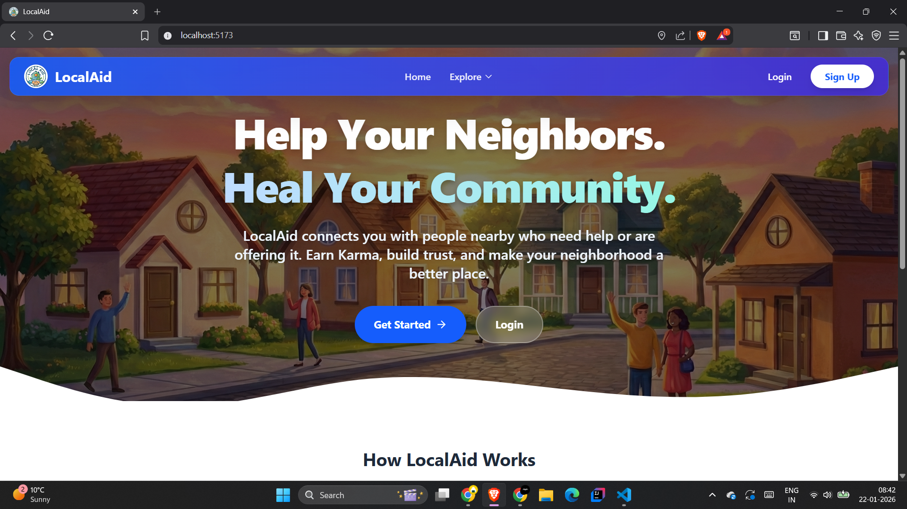

###

Login Page

###

  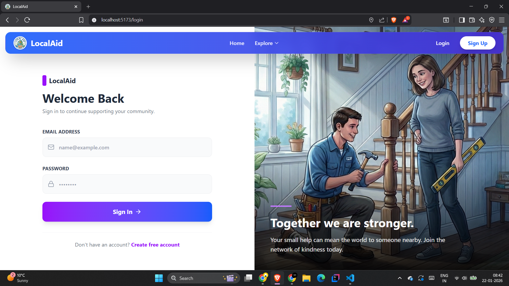

###

Register Page

###

  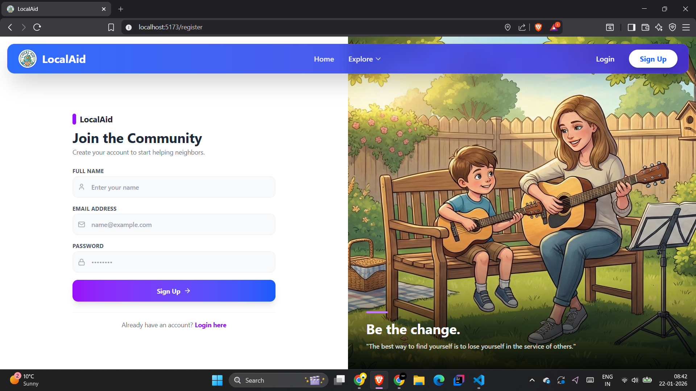

###

Home Page

###

  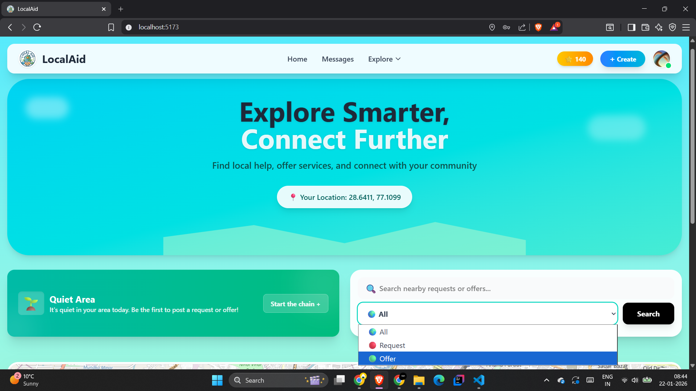

###

Create Post Page- Where user can add offer post or request post with images

###

  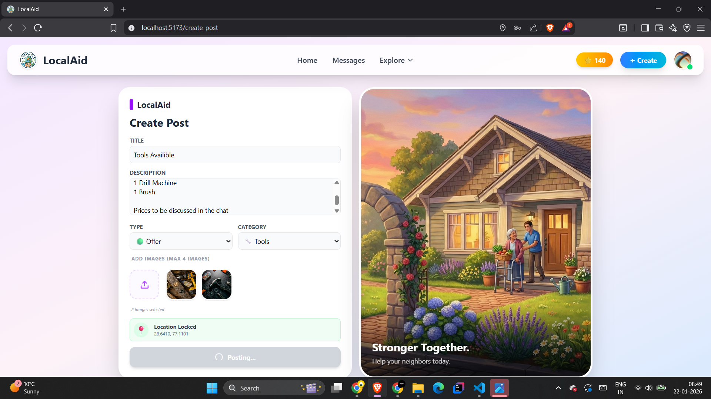

###

Post Cards in homepage - Realtime post display in user accounts within 5kms of range.

###

  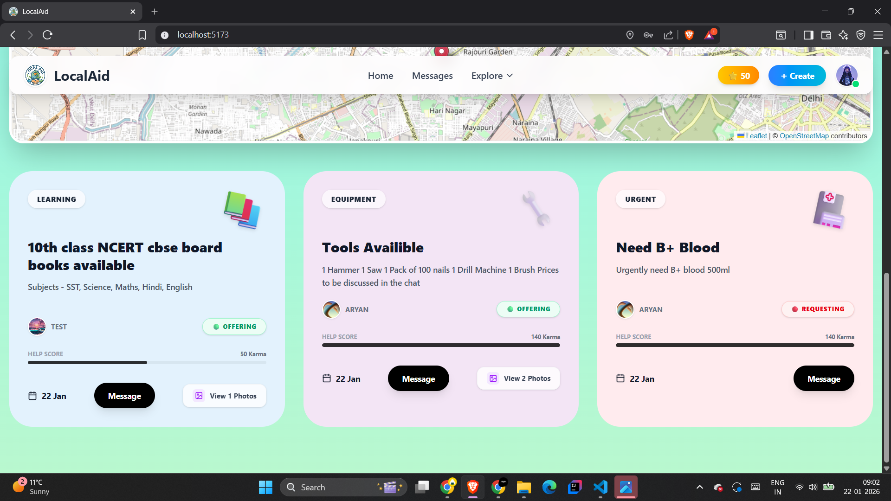

###

Image Display Panel of users post images

###

  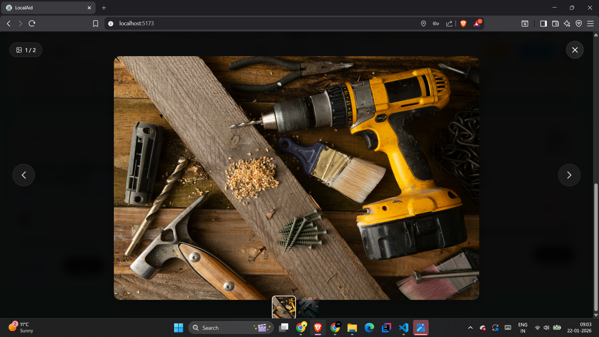

###

Chatbox - Can directly message the post maker from the message button in post cards

###

  

###

Map Pins- Realtime colored pins to display different posts in the near by area

###

  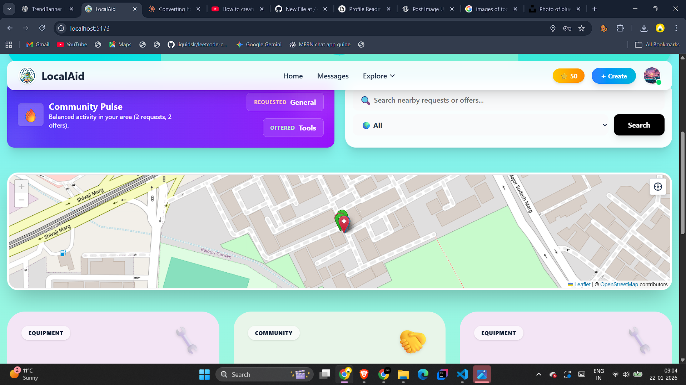

###

AI powered trend banner - Gives overall post summary to the users

###

  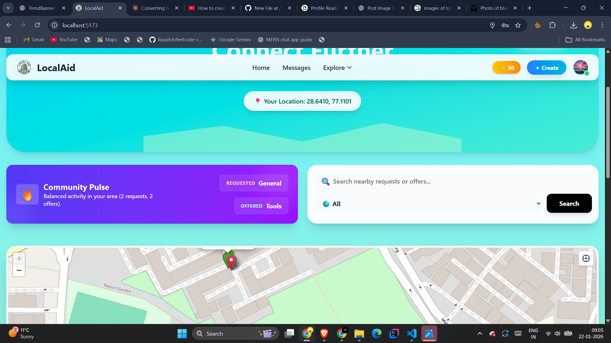

###

Profile Page - Helps handle posts made by the logged in user

###

  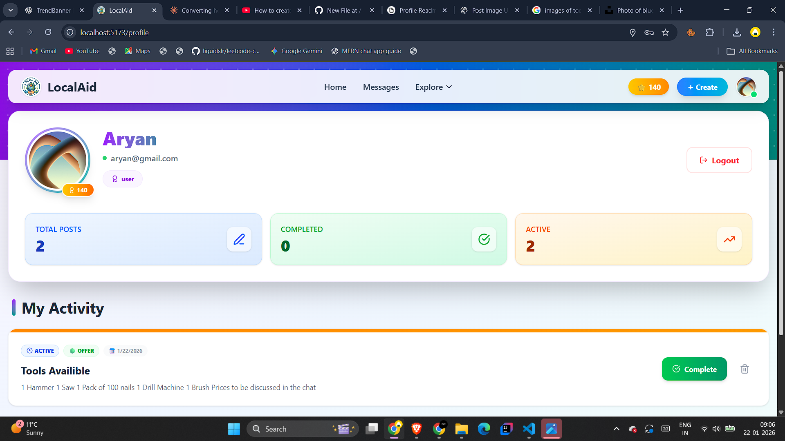

###

Karma Points Reward System- When a post is marked complete by the logged-in user , they can reward points to the helper.

###

  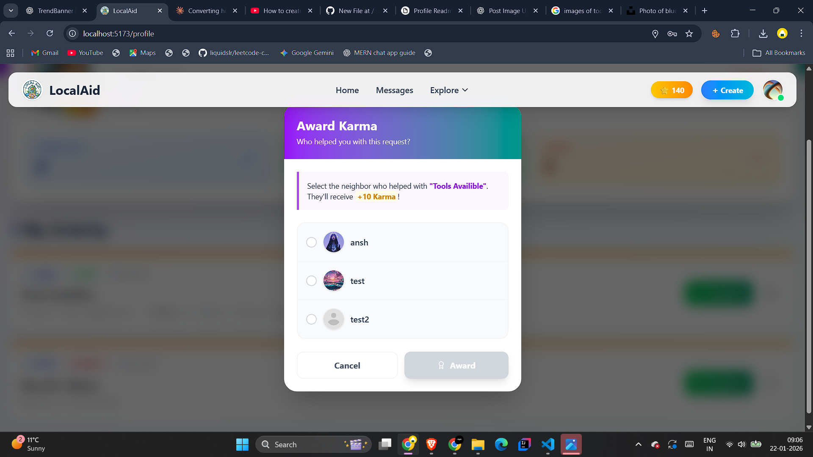

###

<h2 align="left">## 🚀 Live Demo</h2>

###

🔗 **Frontend:** https://your-frontend-url   🔗 **Backend API:** https://your-backend-url

###

<h2 align="left">## 🚧 Future Improvements</h2>

###

Push notifications Admin moderation dashboard Comments on posts Post expiration & auto-cleanup

###

<h2 align="left">## 👨‍💻 Author</h2>

###

Aryan Jarial  GitHub: https://github.com/your-username LinkedIn: https://linkedin.com/in/your-profile

###

<h2 align="left">## Tech used in the project</h2>

###

  
  
  
  
  
  
  
  
  
  
  

###